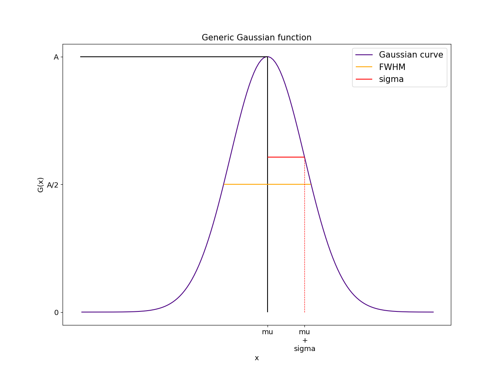
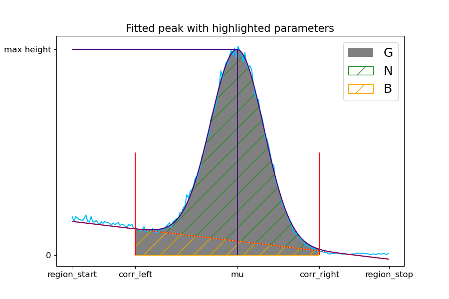

# FittingFunctions2.0
Improved version of the fittingfunctions python module used by the Physics Institution and LTH at Lund University.

Made in python version 3.11.5

>Authored by Erik Ewald & Gustav Sjövall, 2023-2024

## Contents
- [FittingFunctions2.0](#fittingfunctions20)
  - [Contents](#contents)
  - [Importing](#importing)
  - [___Gaussian Functions___](#gaussian-functions)
    - [*```gaussian```* class](#gaussian-class)
      - [Printing](#printing)
      - [Generic peak](#generic-peak)
      - [Public members](#public-members)
      - [Public Methods](#public-methods)
    - [Fitting Functions](#fitting-functions)
      - [```fit_gaussian```](#fit_gaussian)
      - [```fit_double_gaussian```](#fit_double_gaussian)
    - [Spectrum Calibration](#spectrum-calibration)
      - [```calibrate```](#calibrate)
  - [***Miscellaneous***](#miscellaneous)
    - [```misc.slice_spect```](#miscslice_spect)
    - [```misc.is_iter```](#miscis_iter)


## Importing

To import the module, this python file is placed in the working directory for the project and imported into the main file as

```py 
import fitfuncs2 as ff
```

## ___Gaussian Functions___ 
For the following scripts the definition of a Gaussian function is as follows:
$$
G(x) = A\cdot exp\left(-\frac{(x-mu)^2}{2\cdot (sigma)^2}\right)
$$





### *```gaussian```* class
The gaussian class holds the return values from all functions that fit a Gaussian function and is not intended to be used independently. **Printing** a gaussian object gives rounded values. Raw values are accessed as public members or methods. Raw values for uncertainties have to be derived from the covariance matrix.

#### Printing
Example of a gaussian fitted to a Cs-137 peak in a gamma ray spectrum.

```py
[Python3]: print(BGO["662kev"])
========================= Gaussian Peak =========================
Estimated parameters: A = 1740.5264, mu = 661.8352, sigma = 40.6196
Uncertainties: σ(A) = 7.7571, σ(mu) = 0.2089, σ(sigma) = 0.2096
Additional info: Max height = 1915.892, G = 79320, N = 65096, B = 14224

Covariance matrix: 
 [[ 6.01726192e+01  1.87206691e-03 -9.40087680e-01]
 [ 1.87206691e-03  4.36592014e-02 -9.98241359e-05]
 [-9.40087680e-01 -9.98241359e-05  4.39143608e-02]]
```
#### Generic peak




#### Public members

| Member   | Description |
| -------- | ------- |
| *gaussian*.**A** : *float*   | The amplitude of the fitted function. OBS! This does not account for the scatter correction and will sometimes not match the peak height in a spectrum, see *gaussian.max_height()*. |
| *gaussian*.**mu** : *float*   | The central value of the fitted gaussian curve.    |
| *gaussian*.**sigma** : *float*    | The fitted value of sigma.    |
| *gussian*.**cov_matrix** *3x3-array* | The covariance matrix from the fit corresponding to *A, mu* and *sigma*.
| *gussian*.**G** : *float*   | The gross area of the region enclosed by the scatter correction boundaries., i.e. the sum of all y-values in the selected region.
| *gussian*.**B** : *float*  | The scatter background calculated as the sum of the linear scatter correction function across the region enclosed by the scatter correction boundaries.
| *gussian*.**N** : *float*  | The net area of the peak, i.e.  *gussian*.**G** - *gussian*.**B**.

#### Public Methods
| Method   | Description |
| -------- | ------- |
| *gussian*.**area()** : *-> float*| The analytically calculated area of the gaussian. OBS! This may deviate from *gaussian.G* as the bin size in the x-data is not accounted for by this function.
|*gussian*.**FWHM(uncertanty = False** *: bool* **)** : *-> float/tuple* | Return the full-width-half-max value of the peak. Setting *uncertanty* till *True* return a tuple with the FWHM as the first element the uncertainty in FWHM as the second. 
| *gussian*.**max_height()** : *-> float* | Returns the real height of the gaussian at the point *mu*. Calculated as corr_f(mu) + A. | 
|*gussian*.**plot(xlabel = None** *: str* **, ylabel = None** *: str* **)** : *-> None* | Plots the gaussian over the selected region.
|*gussian*.**value(x** *: float* **)** : *-> float* | Returns the value of the gaussian at the point *x*.

### Fitting Functions

#### ```fit_gaussian```
```py
fit_gaussian(X, Y, region_start, region_stop,
            corr_left=None, corr_right=None,
            mu_guess=None, A_guess=None, sigma_guess=None,
            scatter_corr="auto", scatter_corr_points=3, 
            corr_thresh=0.05)
```

Attempts to fit a gaussian function to a data set using the *curve_fit* routine from scipy.optimize.

| Parameter   | Description |
| -------- | ------- |
| X : *array_like*  | An iterator corresponding to the x-axis of the data set.|
| Y : *array_like* | An iterator corresponding to the y-axis of the data set.|
|region_start : *float*  | The lower bound of the region on which the gaussian will be fitted.|
|region_stop : *float*  | The upper bound of the region on which the gaussian will be fitted.|
|corr_left : *float, optional*  | Left point at which scatter correction will be made. This only affects the scatter correction, the fit will always be made over the entire region. |
|corr_right : *float, optional*  | Right point at which scatter correction will be made. This only affects the scatter correction, the fit will always be made over the entire region. |
| mu_guess : *float, optional*  | Manual guess for *mu*.
| A_guess : *float, optional*  | Manual guess for *A*.
| sigma_guess : *float, optional*  | Manual guess for *sigma*.|
|scatter_corr : *str/bool, optional*  | Sets method of scatter correction. ```'auto'``` attempts automatic scatter correction, if this fails *region_start* and *region_stop* will be set as correction boundaries. Manually setting  boundaries will overrule the automatically set boundaries. ```True``` makes scatter correction without automatically set limits. Limits are manually set by *corr_left* and *corr_right*, if one or both of these are not set *region_start* and *region_stop* will be set as correction points. ```False``` no scatter correction is made.
| scatter_corr_points : *int, optional* | The number of points over which the bounds of the scatter correction is averaged. The default 3 means the point is chosen as the average of the first 3 inside the gaussian region.| 
| corr_thresh : *float, optional* | Sets the gradient threshold for determining the edges of the peak when ```sactter_corr='auto'```.

| Returns   | Description |
| -------- | ------- |
| Peak : *gaussian* | An object containing the data from the fit. See the section on the *gaussian* class. 

#### ```fit_double_gaussian```
Attempts to fit a sum of two gaussian functions to a data set using the *curve_fit* routine from scipy.optimize.
```py
fit_double_gaussian(X, Y, region_start, region_stop, split_point,
                    corr_left=None, corr_right=None, 
                    plotting = False,
                    mu1_guess=None, mu2_guess=None,
                    A1_guess=None, A2_guess=None,
                    sigma1_guess=None, sigma2_guess=None,  
                    scatter_corr=True, scatter_corr_points=3)
```
### Spectrum Calibration
Calibrates a spectrum by marking peaks and providing energies corresponding to the marked peaks. 

#### ```calibrate```
```py
calibrate(Y, peak_regions, energies, plot=False, gauss=True)
```
| Parameter  | Description |
| -------- | ------- |
| Y : *array_like* | The dataset corresponding to the y-axis of the spectrum.
| peak_regions : *array_like* | An iterator containing start and stop values for the peak regions to be used in the calibration. A *gaussian* object can be given instead of a start and stop region. Example: ```[[150, 300], (500, 600), gaussian_peak]```.
| energies : *array_like*| Iterator with the energies of the peaks at the corresponding index in *peak_regions*.
| plot : *bool, optional* | Plots the calibrated spectrum and highlight the points used for calibration.
| gauss : *bool, optional* | If ```True``` a gaussian will be fitted to each selected region using the *fit_gaussian* function and the *mu* value is used as the calibration point. If ```False``` the maximum point in the region is used as the calibration point.

| Returns   | Description |
| -------- | ------- |
| calib_x : *numpy.array* | The calibrated x-axis corresponding to the given y-axis.
| (k, m) : *tuple* | The calibration coefficients.


## ***Miscellaneous***
Miscellaneous functions included in the package that might be of some use. 
### ```misc.slice_spect```

### ```misc.is_iter```